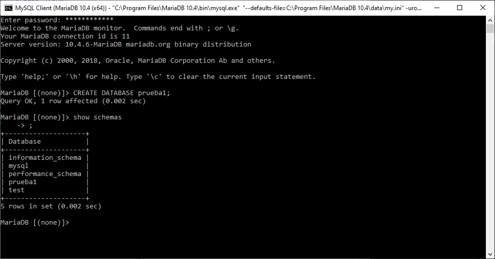

# Tarefa 2

# Instalación MariaDB

Para empezar descargaremos MariaDB para la versión de equipo que estemos usando, en mi caso la versión de 64 bits MSI para Windows.

Despues abrimos el archivo y dejamos la primeras opciones por defecto.

Pondremos la contraseña para el usuario root.

Dejamos las características por defecto.

Y instalamos el programa.

Ahora abrimos las variables del entorno y añadimos la ruta de la carpeta bin del MariaDB en PATH.

Abrimos el CMD y ponemos el comando para ejecutar MariaDB ``mysql -u root -p``, despues de esto ponemos la contraseña del root, que ya establecimos antes.

Con esto ya estaría instalado MariDB, ahora haremos una prueba creando una base de datos a ver si funciona bien. 

