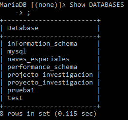

# Tarefa 4

## Comandos de MariaDB ##
En esta tarea se mostrarán comandos de MariaDB que permiten ver la estructura y los datos de una base de datos simulando una GUI en la ventana de comandos, mostrando la sintaxis de estos comandos y capturas para ver el resultado.

### Indice ###
- [Logearse en MariaDB](#LOGIN)
- [Mostrar base de datos.](#SHOWBDD)
- [Usar una base de datos](#USE)
- [Mostrar tablas](#SHOWT)
- [Describir una tabla](#DESC)
- [Mostrar Index tabla](#INDEX)
- [Renombrar una tabla](#RENAME)
- [Reparar una tabla](#REPAIR)
- [Optimizar una tabla](#OPTI)
- [Borrar Registro](#TRUN)
- [Comentar una tabla](#COMMENT)
- [Exportar una base de datos](#EXPORT)

### Logearse en MariaDB 
Este comando sirve para poder entrar en MariaDB desde la ventana de comandos. La sintaxis del comando sería:
	
	mysql -u [nombreUsuario] -p [contraseña]

### Mostrar una base de datos  ###
Este comando sirve para mostrar las bases de datos que tenemos creadas. La sintaxis del comando sería:

	SHOW DATABASES;

### Usar una base de datos  ###
Este comando sirve para especificar la base de datos que queremos usar en concreto. La sintaxis del comando sería:

	USE <nombreDATABASE>;

### Mostrar tablas  ###
Una vez ya selecciona la base de datos que queremos usar y creadas las tablas podemos ver si las tablas estan creadas usando este comando. La sintaxis sería:

	SHOW tables;

Si queremos que la información que se muestre sea mucho mayor usaremos el comando:

	SHOW tables status;

Para especificar una tabla en concreto sería:

	SHOW table status like <nombreTable>;

Tambien podemos usar un comando para enseñar como es la tabla a nivel de código:

	SHOW CREATE TABLE;

### Describir una tabla  ###
Este comando nos sirve para poder ver la estructura interna de una tabla, sus atributos, de que tipo son, cual es la clave primaria, si hay claves foraneas... La sintaxis sería:

	Describe <nombreTable>;

Otra manera de escribir este comando sería:

	SHOW COLUMNS from <nombreTable>;

### Mostrar Index tabla  ###
Este comando sirve para poder ver la información de los indices de la tabla que seleccionemos. La sintaxis sería:

	SHOW INDEX FROM <nombreTable>;

### Renombrar una tabla  ###
Este comando sirve para poder cambiar el nombre a una tabla ya creada sin tener que borrarla y volver a crearla. La sintaxis será:

	RENAME table <nombreTABLE> to <nombreTableNuevo>;

### Reparar una tabla  ###
Este comando sirve para reparar una tabla si tiene algun tipo de fallo o error. La sintaxis será:
	
	REPAIR table <nombreTable>;

En esta tabla este comando no funciona ya que no tiene ningun dato añadido la los atributos, con el siguiente comandos pasará lo mismo.
### Optimizar una tabla  ###
Este comando sirve para optimizar las tablas y que funcione todo mejor. La sintaxis será:

	OPTIMIZE table <nombreTABLE>;

### Borrar registro  ###
Este comando sirve para borrar todos los registros de la tabla que seleccionemos. La sintaxis será:

	TRUNCATE table <nombreTABLE>;

Con esta tabla no podremos borrar el registro ya que tiene FK.

### Comentar una tabla  ###
Este comando nos servirá para poder tener un comentario en una tabla o modificarlo si ya tiene uno establecido. La sintaxis será:

	Alter table <nombreTable> comment='';

### Exportar una base de datos  ###
Este comando nos servirá para exportar una base de datos a un fichero .sql. La sintaxis será:

	mysqldump -u [nombreUsuario] -p[PASSWORD] [nombreDatabase] > fichero.sql
Podemos ver como el archivo se guarda con el nombre que le pongamos y en la ruta desde donde ejecutemos el comando será donde se guarde el archivo.

 

